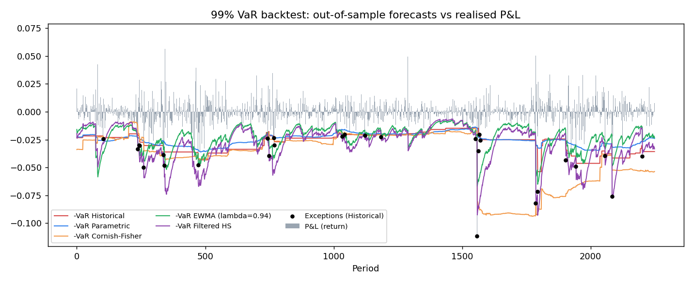
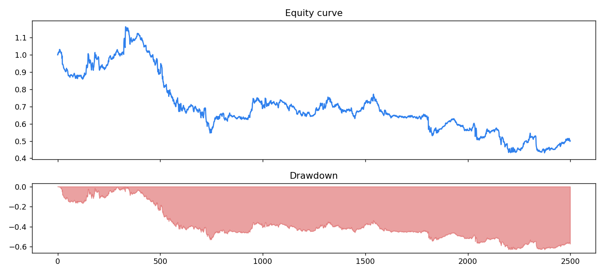

# Strategy Risk & Model Performance Report

- Data: synthetic regime-switching GARCH-t market, EMA(10/50) trend strategy
- Observations: 2500 (backtest window: 2250 out-of-sample, 250-period estimation window)
- Confidence: VaR 99%, ES 97.5%

## 1. VaR backtest

Exceptions = periods where the realised loss exceeded the previous period's VaR forecast.
Kupiec POF tests the exception *rate*; Christoffersen tests whether exceptions *cluster*;
Basel traffic-light zones are scaled to the sample size.

| model              |   exceptions |   expected |   exception_rate |   kupiec_p |   christoffersen_p |   cc_p | traffic_light   | passed   |
|:-------------------|-------------:|-----------:|-----------------:|-----------:|-------------------:|-------:|:----------------|:---------|
| Historical         |           28 |    22.5000 |           0.0124 |     0.2616 |             0.4008 | 0.3742 | GREEN           | True     |
| Parametric         |           40 |    22.5000 |           0.0178 |     0.0008 |             0.2287 | 0.0018 | YELLOW          | False    |
| Cornish-Fisher     |           27 |    22.5000 |           0.0120 |     0.3553 |             0.0034 | 0.0090 | GREEN           | False    |
| EWMA (lambda=0.94) |           48 |    22.5000 |           0.0213 |     0.0000 |             0.9802 | 0.0000 | RED             | False    |
| Filtered HS        |           37 |    22.5000 |           0.0164 |     0.0049 |             0.1488 | 0.0068 | YELLOW          | False    |

**Historical** passes both Kupiec and Christoffersen at 5% and is the recommended model.

## 2. Expected Shortfall (97.5%)

- Mean ES forecast: 3.0382%
- Mean realised loss on Historical-VaR exception days: 4.0181%

## 3. Stress testing

### Volatility stress (returns re-scaled around the mean)

|   vol_multiplier |   VaR_99 |   ES_97.5 |   max_drawdown |
|-----------------:|---------:|----------:|---------------:|
|           1.0000 |   0.0312 |    0.0339 |        -0.6291 |
|           1.5000 |   0.0467 |    0.0507 |        -0.7429 |
|           2.0000 |   0.0622 |    0.0675 |        -0.8317 |
|           3.0000 |   0.0932 |    0.1012 |        -0.9404 |

### Instantaneous shock scenarios (worst exposure held)

| scenario                |    move |   pnl_max_long |   pnl_max_short |   worst |
|:------------------------|--------:|---------------:|----------------:|--------:|
| Black Monday 1987       | -0.2050 |        -0.2050 |          0.2050 | -0.2050 |
| COVID crash (16-Mar-20) | -0.1200 |        -0.1200 |          0.1200 | -0.1200 |
| Short squeeze +10%      |  0.1000 |         0.1000 |         -0.1000 | -0.1000 |
| Flash Crash 2010        | -0.0900 |        -0.0900 |          0.0900 | -0.0900 |
| Generic -5% gap         | -0.0500 |        -0.0500 |          0.0500 | -0.0500 |
| Lehman (15-Sep-2008)    | -0.0470 |        -0.0470 |          0.0470 | -0.0470 |

## 4. Strategy performance

|                |   value |
|:---------------|--------:|
| total_return   | -0.4987 |
| ann_return     | -0.0672 |
| ann_vol        |  0.1691 |
| sharpe         | -0.3264 |
| sortino        | -0.4425 |
| max_drawdown   | -0.6291 |
| calmar         | -0.1069 |
| hit_rate       |  0.4892 |
| turnover       |  0.0588 |
| time_in_market |  0.9992 |

